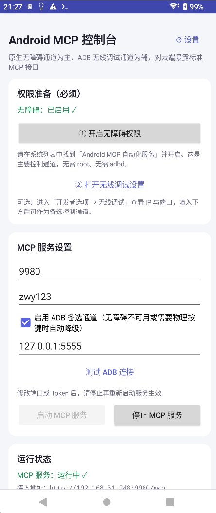

# easy-android-mcp 
一个MCP服务器APK
将 Android 设备变为 MCP 服务器，提供连接给 AI Agent 操控，实现多场景自动化的 APK。工具支持宏定义，方便用户自定义操作和 AI 保存常用操作。

## 功能特性

可以实现的场景包括但不限于：

- 自动化测试
- 自动化操作
- 自动化监控

## 界面预览

## 实现思路

1. 每次执行动作，会自动执行亮屏操作，确保设备在执行动作时是亮屏状态。
2. 如果设备是锁屏状态，会先解锁，再执行动作。

## 使用方法

1. 下载仓库中的 APK 文件，安装到 Android 设备上
2. 打开 APK 文件，开启无障碍权限
3. 在省电管理中，将 APK 文件添加到白名单中
4. 填写好 MCP 服务器的地址和端口，点击启动
5. 将 mcp-skill 添加到你的 Agent 中，Agent 即可掌握技能使用

如需详细了解，可参考 [Android MCP APK 完整教程](https://github.com/yourusername/android-mcp/wiki/Android-MCP-APK-Complete-Tutorial)
